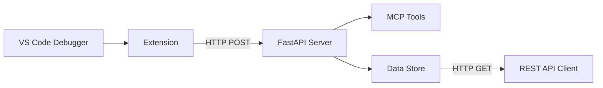

# VS Code Debug MCP for Python (for now...)

**DISCLAIMER:** Much of this was written with Copilot (GPT-5 mini and Sonnet 4.5) as a starting point to learn from. As I've/am learning, more and more of the code is/will be updated with my own code.

Basic description:
A Visual Studio Code extension, and light weight MCP (Model Context Protocol) server for centralized monitoring and analysis where it can be used by AI Agents (like Copilot).

Data is collected using the built-in VS Code debugger and past to the server where it can be directly accessed by Copilot (and others) as a MCP host.

Currently it only debugs Pyton, but the plan is to support JS/TS as well. In a perfect work, it will be smart enough to debug whichever language the current file is.

## ✨ Features

-   🔍 **Real-time Debug Monitoring**: Captures variables, stack traces, and console output
-   🚀 **MCP Integration**: Built with FastMCP for seamless tool integration
-   📡 **RESTful API**: Easy access to debug data via HTTP endpoints
-   ⚙️ **Configurable**: Customizable server URL and enable/disable options
-   🧪 **Well Tested**: Comprehensive test suite

## 🎯 Use Cases

-   **Debug Session Analysis**: Monitor variable changes and execution flow
-   **Remote Debugging**: Possible centralization of debug data from multiple VS Code instances to a single database
-   **Education**: Teaching debugging concepts with visual data flow. Use this tool as an example of how to build out new debugging tools, for Python and other languages
-   **Automation**: Integrate debug information into CI/CD pipelines / AI Agent workflows

## 🚀 Quick Start

### Option A: Global Installation (Recommended for Multi-Workspace Use)

Install once, use everywhere! The server runs globally and works with all your Python projects.

```bash
# Linux/macOS/WSL
chmod +x install-global.sh
./install-global.sh
source ~/.bashrc
mcp-debug-server

# Windows PowerShell
.\install-global.ps1
# Restart PowerShell, then:
powershell "$env:USERPROFILE\.local\bin\mcp-debug-server.ps1"
```

See **[Global Setup Guide](docs/GLOBAL_SETUP.md)** for detailed instructions.

### Option B: Workspace-Specific Installation

1. **Install**

    - Use included server setup script: `server-install.sh` (or `server-install.ps1` for Powershell users)
    - Use included extenssion setup script: `extension-install.sh` (or `extension-install.ps1` for PS users)
      **NOTE:** Shell scripts require execute permissions[^1].

    OR ...

    From the project root install Python packages[^2]:

    ```bash
    cd server && python3 -m venv venv
    source venv/bin/activate
    # Install server dependencies
    pip install -r requirements.txt

    cd ..

    # Install extension dependencies
    cd extension && npm install && npm run compile

    ```

    From the project root install the Node modules:

    ```bash
    cd extension
    npm i
    ```

2. **Start the Server**

    Linux/MacOS/WSL[^2]:

    ```bash
    cd server && source venv/bin/activate && python3 -m uvicorn main:app --host 127.0.0.1 --port 8001
    ```

3. **Open VS Code** in this workspace

4. **Start Debugging** any Python file (F5)

5. **View Debug Data** at `http://localhost:8001/debug-data`

## 🏗️ Architecture



## 📚 Documentation

-   **[Overview](docs/OVERVIEW.md)** - Overview
-   **[Global Setup Guide](docs/GLOBAL_SETUP.md)** - Complete installation and configuration at the global level
-   **[Setup Guide](docs/SETUP_GUIDE.md)** - Complete installation and configuration
-   **[API Reference](#api-endpoints)** - HTTP endpoint documentation
-   **[Sample Test Results](docs/TEST_RESULTS.md)** - Sample test verification and results

## 🔗 API Endpoints

| Endpoint      | Method | Description               |
| ------------- | ------ | ------------------------- |
| `/health`     | GET    | Server health check       |
| `/debug-data` | GET    | Retrieve all debug data   |
| `/debug-data` | POST   | Send debug data to server |
| `/mcp/*`      | \*     | MCP tools endpoints       |

## 🛠️ Development

### Prerequisites

-   Python 3.8+
-   Node.js 16+
-   VS Code with Python extension

### Setup

```bash
cd server && source venv/bin/activate
# Install server dependencies
pip install -r requirements.txt

cd ..

# Install extension dependencies
cd extension && npm install && npm run compile
```

### Testing

```bash
# Run comprehensive test suite
python comprehensive_test.py

# Test specific components
python test_extension_flow.py
```

## 📁 Project Structure

```
vscode-debug-mcp/
├── 📄 README.md                      # This file
├── 📄 Makefile                       # Build automation
├── 📁 docs/                          # Documentation
│   ├── SETUP_GUIDE.md                # Detailed setup instructions
│   ├── TEST_RESULTS.md               # Test verification results
│   ├── API_REFERENCE.md              # API documentation
│   └── OVERVIEW.md                   # Project overview
├── 🔧 scripts/                       # Utility and helper scripts
│   ├── check_endpoints.sh            # Endpoint smoke test script
│   ├── extension_simulator.sh        # Simulates extension network behavior
│   ├── example_mcp_client.py         # Minimal MCP client example
│   ├── inspect_routes.py             # Inspect registered app routes
│   ├── install-global.sh             # Global installer (Linux/Mac)
│   ├── install-global.ps1            # Global installer (PowerShell)
│   ├── server-install.sh             # Server setup script (Linux/Mac)
│   ├── server-install.ps1            # Server setup script (PowerShell)
│   ├── server-start.sh               # Start the server script
│   ├── clean-up.sh                   # Cleanup script (Linux/Mac)
│   ├── CleanUp.ps1                   # Cleanup script (Windows)
│   ├── run_ci_checks.sh              # CI-style wrapper for checks
│   └── (more scripts...)             # other helper scripts
├── 🔧 extension/                     # VS Code extension
│   ├── src/                          # TypeScript source
│   │   └── extension.ts              # Extension source code
│   ├── dist/                         # Compiled extension
│   ├── package.json                  # Extension manifest
│   ├── tsconfig.json                 # TypeScript configuration
│   └── README.md                     # Extension dev instructions
├── 🖥️ server/                        # MCP server
│   ├── main.py                       # FastAPI application
│   ├── main_simple.py                # Simplified server version
│   ├── tools.py                      # MCP tools definitions
│   ├── store.py                      # Data storage layer
│   ├── requirements.txt              # Python dependencies
│   └── tests/                        # Server tests
│       ├── 🧪 test_debug.py          # Sample debug script
│       ├── 🧪 test_extension_flow.py # Extension flow tests
│       └── 🧪 comprehensive_test.py  # Full system tests
├── 📄 tasks.py                       # Task automation
├── 📄 LICENSE                        # Project license (MIT)
└── ⚙️ .vscode/                       # VS Code configuration
    └── launch.json                   # Debug configuration
```

## 🤝 Contributing

Contributions are welcome! Please feel free to submit a Pull Request. For major changes, please open an issue first to discuss what you would like to change.

## 📝 License

This project is licensed under the MIT License - see the [LICENSE](LICENSE) file for details.

## 🙏 Acknowledgments

-   Built with [FastMCP](https://github.com/jlowin/fastmcp) for MCP integration
-   Uses [FastAPI](https://fastapi.tiangolo.com/) for the web server

---

## Footnotes

[^1]: Use `chmod u+x file_name.sh` for each Linux file, or `Set-ExecutionPolicy -ExecutionPolicy RemoteSigned -Scope CurrentUser` for PowerShell
[^2]: Windows Powershell uses `python` in place of `python3`
