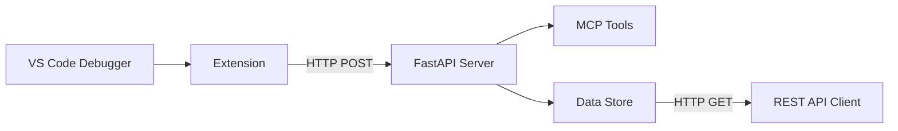

# VS Code Debug MCP for Python (for now...)

A Visual Studio Code extension that captures debug session data forwarding it to a Model Context Protocol (MCP) server for centralized monitoring and analysis where it can be used by AI Agents (like Copilot).

## ✨ Features

- 🔍 **Real-time Debug Monitoring**: Captures variables, stack traces, and console output
- 🚀 **MCP Integration**: Built with FastMCP for seamless tool integration
- 📡 **RESTful API**: Easy access to debug data via HTTP endpoints
- ⚙️ **Configurable**: Customizable server URL and enable/disable options
- 🧪 **Well Tested**: Comprehensive test suite

## 🎯 Use Cases

- **Debug Session Analysis**: Monitor variable changes and execution flow
- **Remote Debugging**: Centralize debug data from multiple VS Code instances
- **Education**: Teaching debugging concepts with visual data flow
- **Development Tools**: Build custom tools on top of debug data
- **Automation**: Integrate debug information into CI/CD pipelines

## 🚀 Quick Start

1. **Install**

    From the project root install Python packages:
    ```bash
    cd server && python3 -m venv venv
    source venv/bin/activate
    # Install server dependencies
    pip install -r requirements.txt

    cd ..

    # Install extension dependencies  
    cd extension && npm install && npm run compile

    ```
    From the project root install the Node modules:
    ```bash
    cd extension
    npm i
    ```
    **NOTE:** Windows Powershell uses `python` in place of `python3`

2. **Start the Server**

    Linux/MacOS/WSL:
    ```bash
    cd server && source venv/bin/activate && python3 -m uvicorn main:app --host 127.0.0.1 --port 8001
    ```
    **NOTE:** Windows Powershell uses `python` in place of `python3`

3. **Open VS Code** in this workspace

4. **Start Debugging** any Python file (F5)

5. **View Debug Data** at `http://localhost:8001/debug-data`

## 🏗️ Architecture



## 📚 Documentation

- **[Setup Guide](docs/SETUP_GUIDE.md)** - Complete installation and configuration
- **[Test Results](docs/TEST_RESULTS.md)** - Detailed test verification and results
- **[API Reference](#api-endpoints)** - HTTP endpoint documentation

## 🔗 API Endpoints

| Endpoint | Method | Description |
|----------|--------|-------------|
| `/health` | GET | Server health check |
| `/debug-data` | GET | Retrieve all debug data |
| `/debug-data` | POST | Send debug data to server |
| `/mcp/*` | * | MCP tools endpoints |

## 🛠️ Development

### Prerequisites
- Python 3.8+
- Node.js 16+
- VS Code with Python extension

### Setup
```bash
cd server && source venv/bin/activate
# Install server dependencies
pip install -r requirements.txt

cd ..

# Install extension dependencies  
cd extension && npm install && npm run compile
```

### Testing
```bash
# Run comprehensive test suite
python comprehensive_test.py

# Test specific components
python test_extension_flow.py
```

## 📁 Project Structure

```
vscode-debug-mcp/
├── 📄 README.md                 # This file
├── 📄 SETUP_GUIDE.md           # Detailed setup instructions
├── 📄 TEST_RESULTS.md          # Test verification results
├── 🔧 extension/               # VS Code extension
│   ├── src/extension.ts        # Extension source code
│   ├── package.json           # Extension manifest
│   └── dist/extension.js      # Compiled extension
├── 🖥️ server/                  # MCP server
│   ├── main.py                # FastAPI application
│   ├── tools.py               # MCP tools definitions
│   ├── store.py               # Data storage layer
│   └── requirements.txt       # Python dependencies
├── 🧪 test_debug.py            # Sample debug script
├── 🧪 test_extension_flow.py   # Extension flow tests
├── 🧪 comprehensive_test.py    # Full system tests
└── ⚙️ .vscode/                 # VS Code configuration
    └── launch.json            # Debug configuration
```

## 🤝 Contributing

Contributions are welcome! Please feel free to submit a Pull Request. For major changes, please open an issue first to discuss what you would like to change.

## 📝 License

This project is licensed under the MIT License - see the [LICENSE](LICENSE) file for details.

## 🙏 Acknowledgments

- Built with [FastMCP](https://github.com/jlowin/fastmcp) for MCP integration
- Uses [FastAPI](https://fastapi.tiangolo.com/) for the web server
- Inspired by the need to learn!

---

**Ready to enhance your debugging experience?** 🚀

Start with the [Setup Guide](SETUP_GUIDE.md) or jump right in with the Quick Start above!