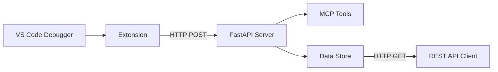

# VS Code Debug MCP for Python (for now...)

A Visual Studio Code extension, and light weight MCP (Model Context Protocol) server for centralized monitoring and analysis where it can be used by AI Agents (like Copilot).

Data is collected using the built-in VS Code debugger and past to the server where it can be directly accessed by Copilot (and others) as a MCP host

## ✨ Features

- 🔍 **Real-time Debug Monitoring**: Captures variables, stack traces, and console output
- 🚀 **MCP Integration**: Built with FastMCP for seamless tool integration
- 📡 **RESTful API**: Easy access to debug data via HTTP endpoints
- ⚙️ **Configurable**: Customizable server URL and enable/disable options
- 🧪 **Well Tested**: Comprehensive test suite

## 🎯 Use Cases

- **Debug Session Analysis**: Monitor variable changes and execution flow
- **Remote Debugging**: Possible centralization of debug data from multiple VS Code instances to a single database
- **Education**: Teaching debugging concepts with visual data flow. Use this tool as an example of how to build out new debugging tools, for Python and other languages
- **Automation**: Integrate debug information into CI/CD pipelines / AI Agent workflows

## 🚀 Quick Start

1. **Install**

    - Use included server setup script: `server-install.sh` (or `server-install.ps1` for Powershell users)
    - Use included extenssion setup script: `extension-install.sh` (or `extension-install.ps1` for PS users)
    **NOTE:** Shell scripts require execute permissions[^1].

    OR ...

    From the project root install Python packages[^2]:
    ```bash
    cd server && python3 -m venv venv
    source venv/bin/activate
    # Install server dependencies
    pip install -r requirements.txt

    cd ..

    # Install extension dependencies  
    cd extension && npm install && npm run compile

    ```
    From the project root install the Node modules:
    ```bash
    cd extension
    npm i
    ```

2. **Start the Server**

    Linux/MacOS/WSL[^2]:
    ```bash
    cd server && source venv/bin/activate && python3 -m uvicorn main:app --host 127.0.0.1 --port 8001
    ```

3. **Open VS Code** in this workspace

4. **Start Debugging** any Python file (F5)

5. **View Debug Data** at `http://localhost:8001/debug-data`

## 🏗️ Architecture



## 📚 Documentation

- **[Setup Guide](docs/SETUP_GUIDE.md)** - Complete installation and configuration
- **[Test Results](docs/TEST_RESULTS.md)** - Detailed test verification and results
- **[API Reference](#api-endpoints)** - HTTP endpoint documentation

## 🔗 API Endpoints

| Endpoint | Method | Description |
|----------|--------|-------------|
| `/health` | GET | Server health check |
| `/debug-data` | GET | Retrieve all debug data |
| `/debug-data` | POST | Send debug data to server |
| `/mcp/*` | * | MCP tools endpoints |

## 🛠️ Development

### Prerequisites
- Python 3.8+
- Node.js 16+
- VS Code with Python extension

### Setup
```bash
cd server && source venv/bin/activate
# Install server dependencies
pip install -r requirements.txt

cd ..

# Install extension dependencies  
cd extension && npm install && npm run compile
```

### Testing
```bash
# Run comprehensive test suite
python comprehensive_test.py

# Test specific components
python test_extension_flow.py
```

## 📁 Project Structure

```
vscode-debug-mcp/
├── 📄 README.md                    # This file
├── 📄 Makefile                     # Build automation
├── 🔧 server-install.sh            # Server setup script (Linux/Mac)
├── 🔧 server-install.ps1           # Server setup script (Windows)
├── 🔧 server-start.sh              # Server start script
├── 🔧 clean-up.sh                  # Cleanup script (Linux/Mac)
├── 🔧 CleanUp.ps1                  # Cleanup script (Windows)
├── 📁 docs/                        # Documentation
│   ├── SETUP_GUIDE.md             # Detailed setup instructions
│   ├── TEST_RESULTS.md            # Test verification results
│   ├── API_REFERENCE.md           # API documentation
│   └── OVERVIEW.md                # Project overview
├── 🔧 extension/                   # VS Code extension
│   ├── src/extension.ts           # Extension source code
│   ├── package.json               # Extension manifest
│   ├── tsconfig.json              # TypeScript configuration
│   └── dist/extension.js          # Compiled extension
├── 🖥️ server/                      # MCP server
│   ├── main.py                    # FastAPI application
│   ├── main_simple.py             # Simplified server version
│   ├── tools.py                   # MCP tools definitions
│   ├── store.py                   # Data storage layer
│   ├── requirements.txt           # Python dependencies
│   ├── test_main.py               # Server tests
│   ├── test_mcp_tools.py          # MCP tools tests
│   └── venv/                      # Python virtual environment
├── 🧪 test_debug.py                # Sample debug script
├── 🧪 test_extension_flow.py       # Extension flow tests
├── 🧪 comprehensive_test.py        # Full system tests
├── 📄 tasks.py                     # Task automation
└── ⚙️ .vscode/                     # VS Code configuration
    └── launch.json                # Debug configuration
```

## 🤝 Contributing

Contributions are welcome! Please feel free to submit a Pull Request. For major changes, please open an issue first to discuss what you would like to change.

## 📝 License

This project is licensed under the MIT License - see the [LICENSE](LICENSE) file for details.

## 🙏 Acknowledgments

- Built with [FastMCP](https://github.com/jlowin/fastmcp) for MCP integration
- Uses [FastAPI](https://fastapi.tiangolo.com/) for the web server
- Inspired by the need to learn!

---

**Ready to enhance your debugging experience?** 🚀

Start with the [Setup Guide](SETUP_GUIDE.md) or jump right in with the Quick Start above!

---

## Footnotes

[^1]: Use `chmod u+x file_name.sh` for each Linux file, or `Set-ExecutionPolicy -ExecutionPolicy RemoteSigned -Scope CurrentUser` for PowerShell
[^2]: Windows Powershell uses `python` in place of `python3`