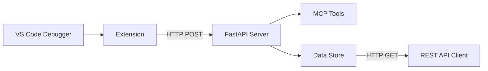

# VS Code Debug MCP for Python (for now...)

[< Back](../README.md)

## 🏗️ Architecture

## 📚 Documentation

- **[Setup Guide](docs/SETUP_GUIDE.md)** - Complete installation and configuration
- **[Test Results](docs/TEST_RESULTS.md)** - Detailed test verification and results
- **[API Reference](#api-endpoints)** - HTTP endpoint documentation

## 🔗 API Endpoints

| Endpoint | Method | Description |
|----------|--------|-------------|
| `/health` | GET | Server health check |
| `/debug-data` | GET | Retrieve all debug data |
| `/debug-data` | POST | Send debug data to server |
| `/mcp/*` | * | MCP tools endpoints |